# Virtual Science Lab

A voice-first virtual science lab for CBSE Grade-6 students, built for classrooms and homes that don't have a physical lab. A child picks a language, walks into a 3D experiment, manipulates it, asks questions out loud, and gets asked questions back — and the teacher gets a plain-language report of what the child did and understood.

This is a hackathon build: one experiment (Chemistry — Separation of Substances) working end to end, on an engine designed to take three more for free.

---

## Walkthrough

A real run, captured end to end — language + experiment pick, the 3D scene, a checkpoint answered correctly in Hindi by a live Sarvam call, and the resulting teacher report.

<video src="docs/video/virtual-science-lab-demo.mov" controls preload="metadata" width="100%">
  Your browser does not support the video tag. Download the <a href="docs/video/virtual-science-lab-demo.mov">demo recording</a> instead.
</video>

| | |
|---|---|
| 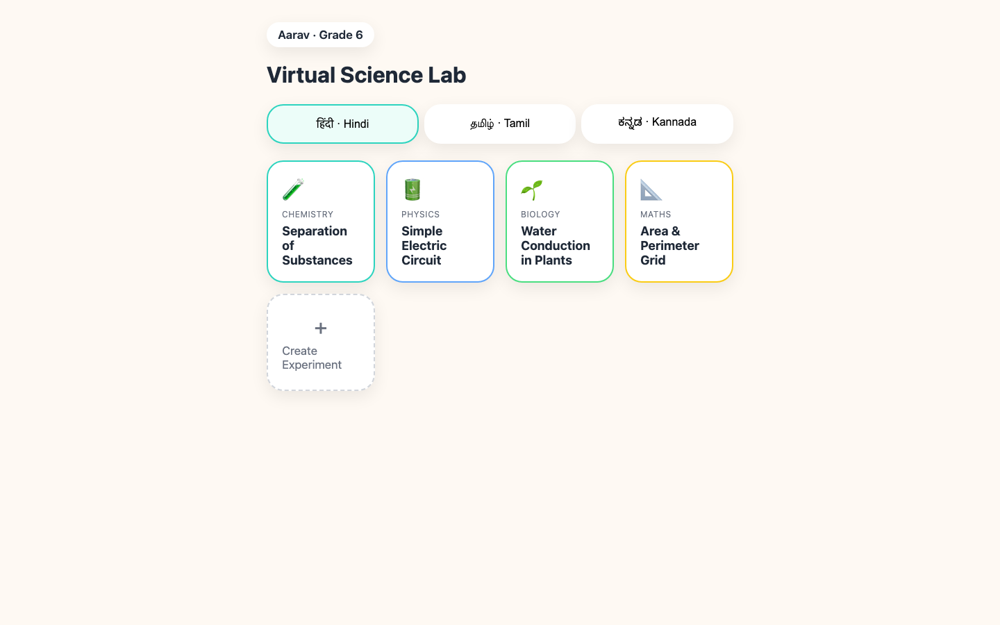 **Home** — pick a language and an experiment. | 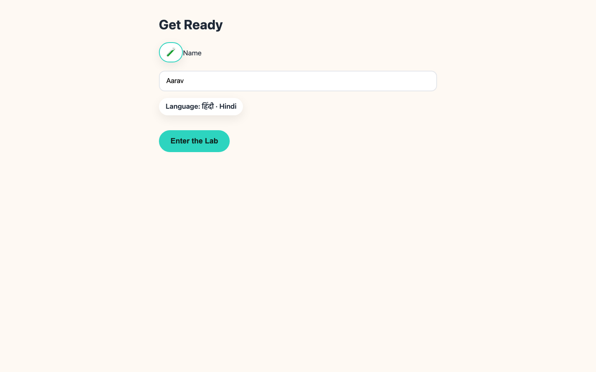 **Setup** — confirm the child's name; this greeting gets injected into the guide's first line. |
| 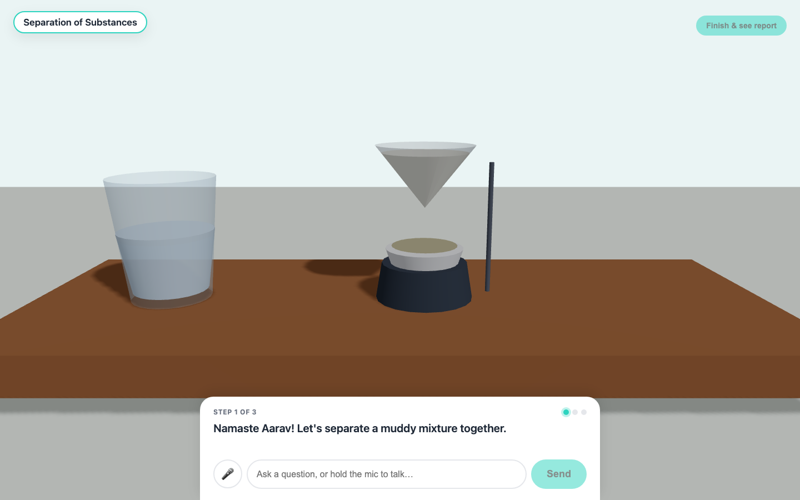 **Scene** — the bench, ready for step 1 (stir). | 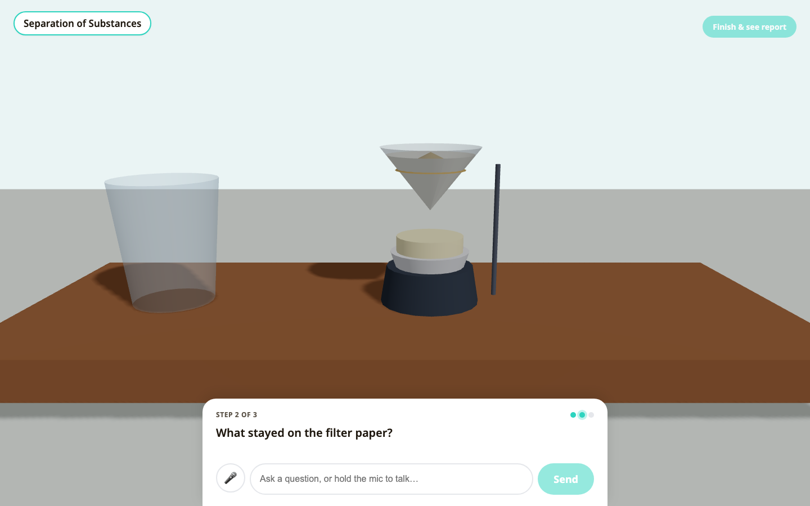 **Checkpoint** — after filtering, the guide asks what stayed behind, in the child's language. |
| 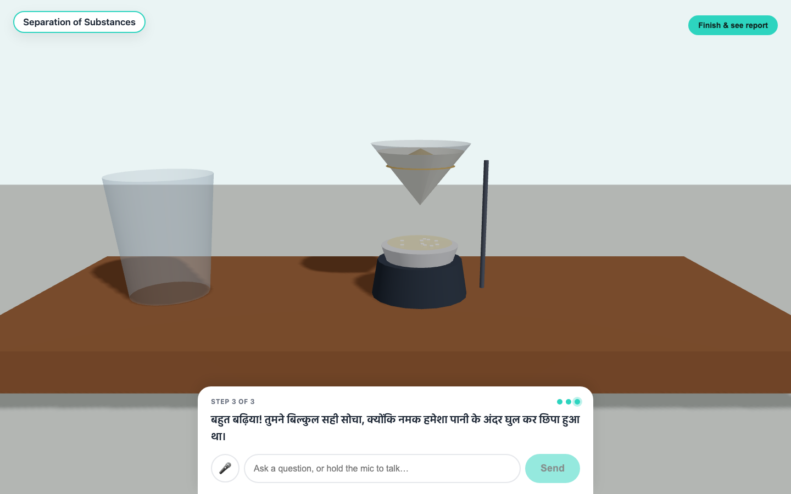 **Answered correctly** — real `sarvam-105b-conversations` reply, in Hindi, affirming the child's answer. | 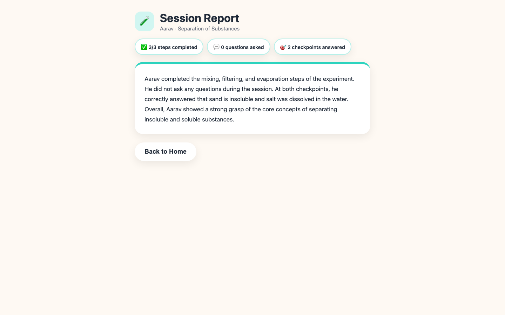 **Report** — generated by `sarvam-105b` from the session's `event_log`. |

---

## The problem

Millions of Grade-6 students in under-resourced schools are taught chemistry, physics, biology and maths **without ever touching a lab**. Concepts like filtration, circuits, or evaporation are taught as diagrams on a blackboard, in a language the child may not think in, with no way to check whether the idea actually landed until a written exam weeks later.

Three things compound the problem:

- **No apparatus.** Physical labs are expensive, need trained staff, and are the first thing a resource-strapped school cuts.
- **No feedback loop.** A textbook or a video is one-directional. Nobody asks the child "why did the sand stay on the paper?" in the moment they're looking at it.
- **No language fit.** Most digital science content is English-first. A child who thinks in Hindi, Tamil, or Kannada is doing a translation task on top of a science task.

## The gap in what already exists

| Category | What it offers | What's missing |
|---|---|---|
| Textbook / blackboard | Structured curriculum | Static, no manipulation, no feedback |
| YouTube / recorded video | Visual explanation | One-directional, not adaptive to the child |
| Existing "virtual lab" web apps | Interactive simulation | English-only, no voice, no comprehension check, no teacher visibility |
| Generic ed-tech chatbots | Q&A | Not grounded in *what the child is doing right now* in a scene |

Nothing sits at the intersection of **simulated apparatus + spoken regional-language dialogue + in-the-moment comprehension checks + a report a teacher can actually use**. That intersection is the product.

## How we're solving it

A **single stateless agent** driven entirely by what the frontend tells it is happening in the scene, plus a small library of **experiment configs** (JSON) that describe steps, concepts, and checkpoint questions. One engine, N experiments — a new subject is a new JSON file, not new code.

The core loop, repeated for every step of the experiment:

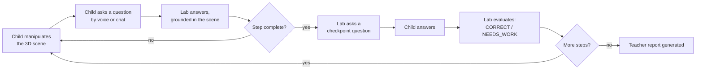

Because the scene owns the world state and posts it with every turn, the "brain" never has to remember what happened — it just reacts to the current truth, every time. That's what makes one agent enough for four subjects.

---

## Architecture

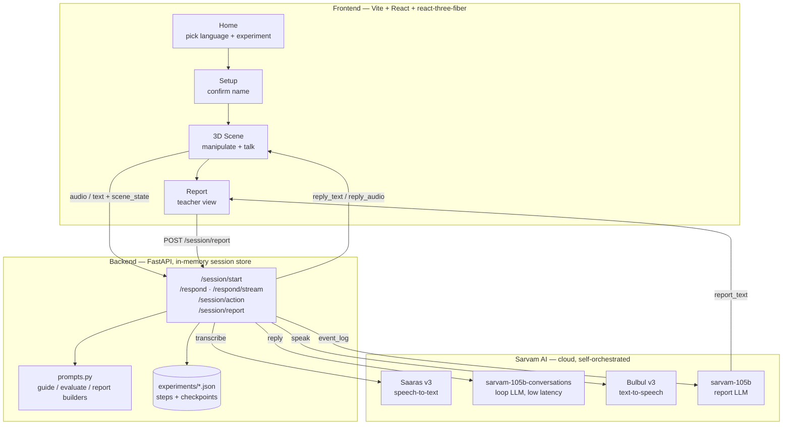

**The one architectural idea that makes this simple:** the agent is stateless about the world. `scene_state` is injected into the prompt on every single turn — nothing is inferred or remembered about *what's happening in the lab* between turns, only conversation history for tone. This is what lets one prompt template serve chemistry, physics, biology, and maths without branching logic.

### A single voice turn, end to end

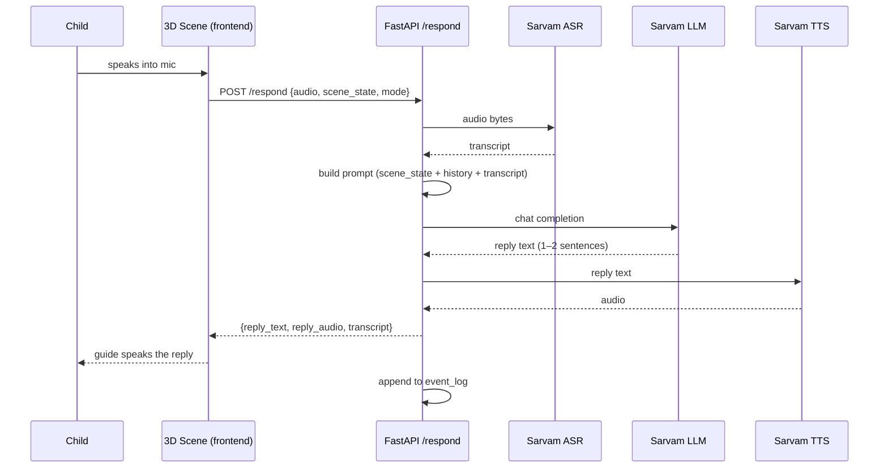

Text chat takes the same path minus the ASR/TTS hops — same brain, and the on-stage fallback if voice or wifi fails during a demo.

### Session state (server-side, in-memory, keyed by `session_id`)

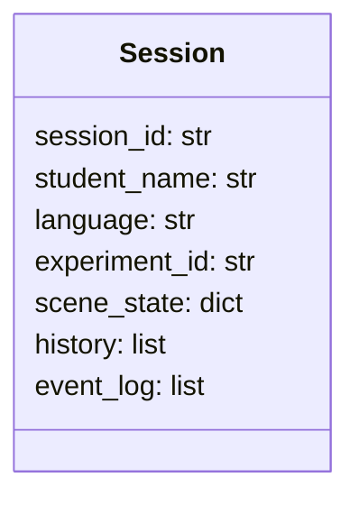

- `scene_state` — posted by the frontend every turn; drives the prompt.
- `history` — last ~4 turns, keeps replies from repeating themselves.
- `event_log` — appended on every meaningful action from turn one; the report is built from this, not reconstructed after the fact.

---

## Technical stack

| Layer | Choice | Why |
|---|---|---|
| Backend | Python + FastAPI, in-memory session dict | No DB needed for a single-session demo; nothing to provision |
| Frontend | Vite + React + `@react-three/fiber` | Fast dev loop; Three.js scene as plain React components |
| ASR | Sarvam **Saaras v3** (`saaras:v3`) | Same-language transcription across Hindi/Tamil/Kannada |
| Loop LLM | Sarvam **`sarvam-105b-conversations`** | Sarvam's real-time-dialogue variant — the low-latency choice for a live back-and-forth |
| Report LLM | Sarvam **`sarvam-105b`** | Used once per session; quality over speed |
| TTS | Sarvam **Bulbul v3** (`bulbul:v3`), voice `priya` | REST first, WebSocket streaming as a latency polish pass |
| 3D scene assets | r3f primitives (cylinders/boxes/cones) | No `.glb` hunting/licensing inside a 3-hour build |

**Scene assets are geometric primitives, not models** — the beaker, funnel, burner, and dish in `ChemScene.jsx` are built from Three.js primitives directly. That's a deliberate scope call, not a placeholder.

### Endpoints

| Endpoint | Purpose |
|---|---|
| `POST /session/start` | Creates a session, returns a greeting in the child's language, using their name |
| `POST /respond` | Core loop: text or audio in → guide reply (and audio) out. `mode=guide` teaches; `mode=evaluate` judges a checkpoint answer |
| `POST /respond/stream` | Streaming twin for voice: streams LLM tokens and speaks each finished clause via Bulbul WebSocket TTS as it's ready, instead of waiting for the full reply |
| `POST /session/action` | Logs a physical scene gesture (stir / pour / heat) to `event_log` — no LLM call |
| `POST /session/report` | Builds the 4–6 line teacher report from `event_log` via `sarvam-105b` |
| `GET /experiments/{id}` | Serves an experiment config so the frontend can drive step/checkpoint progression from the same source of truth as the backend |
| `POST /warmup` | Fires one throwaway LLM call to kill Sarvam's cold-start latency before the child's first real turn |

### Latency plan (target: perceived < 1s to first audio)

1. `sarvam-105b-conversations` in the loop, not the heavier report model.
2. Stream LLM output straight into Bulbul's WebSocket TTS, clause by clause, instead of waiting for the full reply.
3. Prompts cap replies at 1–2 sentences — both for latency and because it's for a Grade-6 child.
4. Pre-warm the pipeline (`/warmup`) right before a session starts.
5. Chat is the stage-insurance fallback: it skips ASR/TTS entirely and is near-instant if voice or wifi fails mid-demo.

### Extensibility — one engine, four experiments

Every subject is a JSON config with the same shape: `steps` (instruction, action, concept, resulting `state_change`) and `checkpoints` (question, expected idea, hint). The engine doesn't know it's doing chemistry versus circuits versus plant biology — it only ever sees "current step" and "current checkpoint."

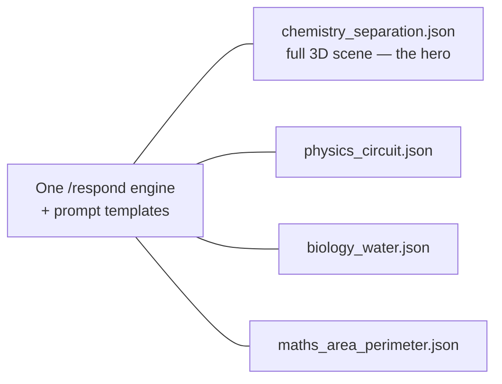

Adding subject #5 is authoring a config file, not writing new agent logic.

---

## What's actually built vs. claimed (hackathon scope, by design)

This is a 3-hour build, scoped deliberately so the one thing that must work, works flawlessly:

**Built end to end:** Chemistry — Separation of Substances, full loop — 3D manipulation → ask (voice/chat) → get answered → get quizzed at each checkpoint → evaluated → teacher report. Hindi (`hi-IN`) is the locked demo language.

**Claimed, not built:** Physics, Biology, and Maths exist as experiment configs consumable by the same engine, proving the "one engine, N subjects" claim — without three more bespoke 3D scenes. The teacher "Create Experiment" flow is an intentionally dummy modal (a convincing generation animation, then a pre-baked result) — it sells the authoring story without a real prompt→scene pipeline.

**Deliberately out of scope:** auth, a database, session persistence across restarts, real file upload processing, and any voice-agent framework (Vapi/Pipecat) — the backend self-orchestrates Sarvam directly instead.

---

## Impact

- **Removes the apparatus bottleneck.** A school with a browser and a mic can run a lab session with zero physical equipment or trained lab staff — the constraint that keeps hands-on science out of the most under-resourced classrooms.
- **Meets the child in their language.** Regional-language voice interaction removes the translation tax that English-only digital science content imposes on the majority of Indian students.
- **Closes the feedback loop in the moment.** Checkpoint questions fire right after the relevant step, while the concept is still live in front of the child — not three weeks later on a written exam.
- **Gives teachers signal they don't currently have.** A session report tells a teacher exactly what a child did, what they asked, and where they struggled — visibility a worksheet or a video never provides.
- **Scales by config, not by headcount.** Because every subject is a JSON file consumed by one engine, expanding coverage is an authoring cost, not an engineering one — the mechanism the roadmap (on-device Gemma, more subjects, more languages) leans on.

---

## Repo layout

```
virtual-lab/
  CLAUDE.md            # source of truth for scope, architecture, conventions
  DESIGN.md            # screens + experiment-config schema
  BUILD_GUIDE.md        # prerequisites + build order
  backend/
    main.py            # FastAPI app + endpoints
    sarvam.py           # Sarvam ASR / LLM / TTS wrappers
    session.py           # in-memory session store
    prompts.py           # guide / evaluate / report prompt builders
    experiments/          # one JSON config per subject
  frontend/
    src/
      screens/            # Home, Setup, Scene, Report
      scene/               # ChemScene, GenericScene, scene state
      components/           # DialogueCard, MicButton, CreateExperimentModal
      lib/                  # api client, voice capture/playback
```

See [CLAUDE.md](CLAUDE.md) for the full architecture rationale and build order, and [DESIGN.md](DESIGN.md) for screen-by-screen behavior and the experiment config schema.
